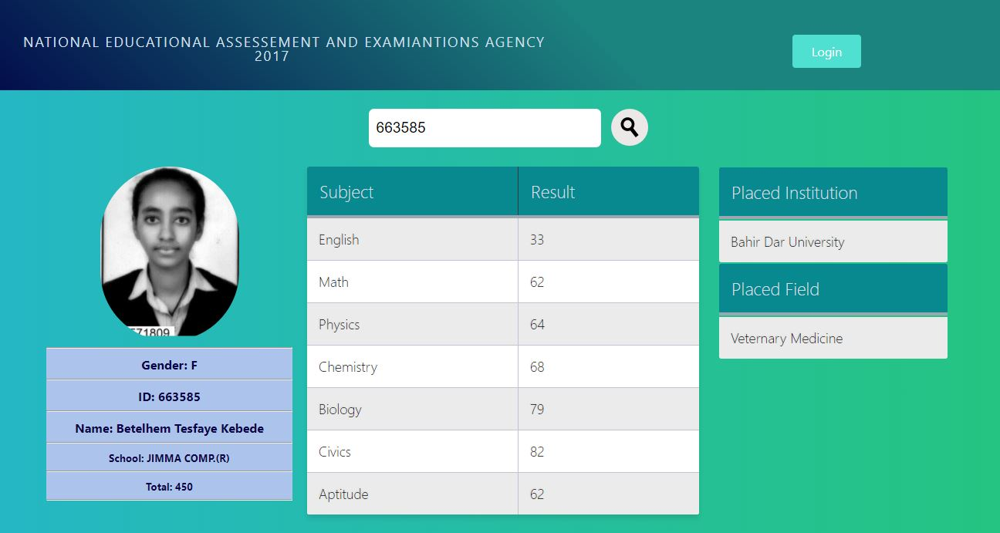

A simple Server-Client Archetectural Application

It's a clone of the Popular NEAEA Ethiopia University Entrance Examination result website.  where students input their ID and see thier exam result. 

Also it has admin panel where the official's add and edit student results.

Architectural Design
-It's Client-Server app.
In addition, the Client Side uses MVC pattern to render the data recieved from server. 

Here is screenshot for student panel which don't require to login

Here is the screenshot for admin panel 

